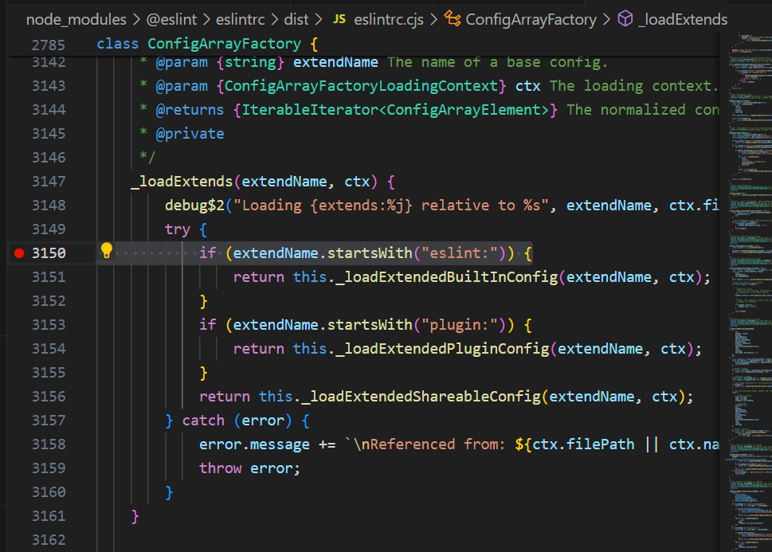
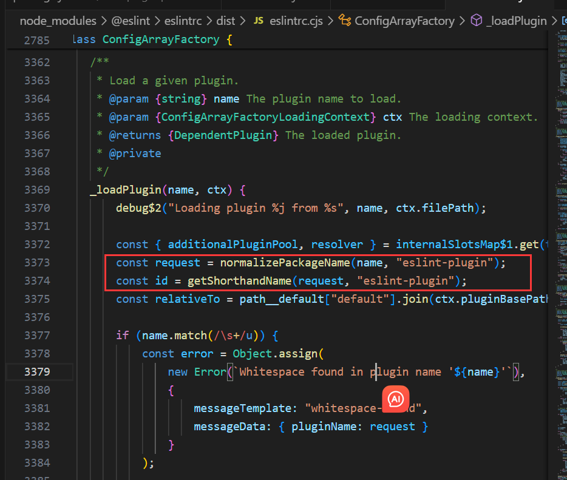

### eslint 源码分析

- Q: 以下写法有啥区别
  ```
  "eslint:recommended",
  "plugin:@typescript-eslint/recommended",
  "plugin:prettier/recommended",
  ```

  A: eslint内部区分了eslint:, plugin:@*\*, plugin:*\*
  <details>
    <summary>展开详情 "eslint@8.57.0"</summary>

    

    ;
  </details>

  可以看到@typescript-eslint,自动加上了eslint-plugin的子集文件夹,所以最终查找文件夹为
  node_modules/@typescript-eslint/eslint-plugin

  prettier自动加上了eslint-plugin-prettier的eslint-plugin前缀,所以最终查找文件夹为
  node_modules/eslint-plugin-prettier

  然后去找对应文件夹下面package.json里面的main属性或者export.default指向地址
